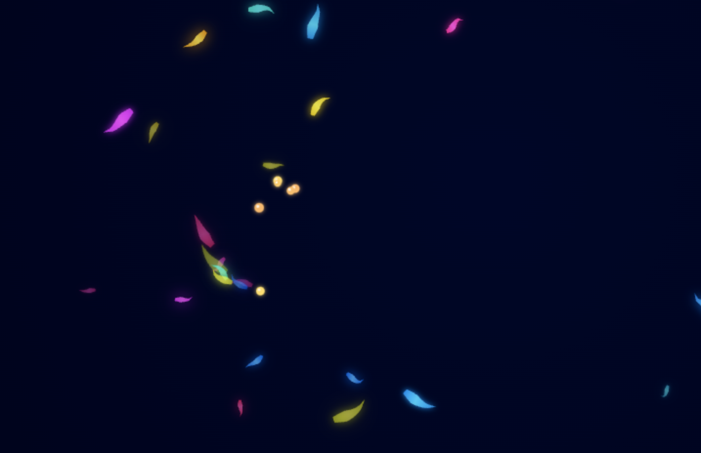

# Luminous Fish Simulation 🐠✨

An interactive procedural aquarium featuring bioluminescent fish with realistic physics-based movement.



## [Live Demo](https://procedural-aquarium.vercel.app/)

## Overview

This project creates a mesmerizing virtual aquarium with procedurally generated luminous fish. Each fish features a dynamic spine system that provides fluid, natural swimming patterns based on simulated water physics.

### Features

- **Procedural Animation**: Fish move with a realistic spine-based movement system
- **Interactive Environment**: 
  - Left-click to add food particles that attract fish
  - Right-click to spawn new fish
  - Mouse movement creates gentle water currents
- **Bioluminescence Effects**: Fish glow and pulse with vibrant colors
- **Adaptive Behavior**: Fish adapt their swimming patterns based on energy levels
- **Responsive Design**: Works on both desktop and mobile devices

## How It Works

The simulation uses several advanced techniques to create realistic aquatic movement:

- **Dynamic Flow System**: Simulates natural water currents and fish swimming behavior
- **Spine Physics**: Each fish has a flexible spine that responds to movement and currents
- **Bioluminescent Rendering**: Custom rendering techniques create the glowing effect
- **Food-seeking Behavior**: Fish are attracted to food when hungry
- **Fluid Dynamics**: Water currents affect both fish and food particles

## Controls

### Desktop
- **Left-click**: Add food particles that attract fish
- **Right-click**: Add a new fish at cursor position
- **Mouse movement**: Creates gentle water currents

### Mobile
- **Tap**: Add food particles that attract fish
- **Double-tap**: Add a new fish at tap position
- **Touch and drag**: Creates gentle water currents

## Technical Details

This project is built with pure JavaScript and HTML5 Canvas, without any external libraries. The animation uses requestAnimationFrame for smooth performance, and implements custom physics calculations for the water flow and fish movement.

## Development

Clone this repository and open the `index.html` file in your browser to run the simulation locally:

```bash
git clone https://github.com/davidroman0O/aquarium-fish-procedural.git
cd aquarium-fish-procedural
# Open index.html in your browser
```

## Future Enhancements Ideas

- Additional fish species
- More interaction options
- Environment obstacles
- Day/night cycle
- Reproduction? (Implies fishes might die... my fishes NEVER DIES)

## License

[MIT License](LICENSE)
